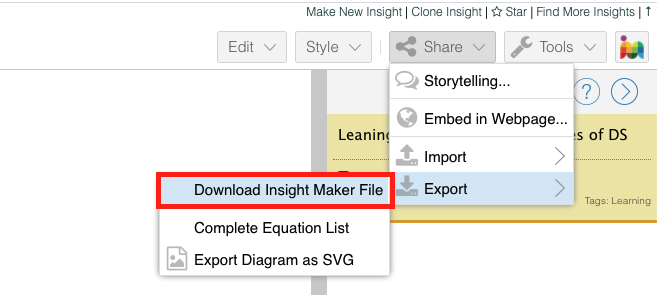

# InsightMaker

InsightMaker is a library that lets you use the Insight Maker API (https://insightmaker.com) on your Node.js projects.
By installing you will be able to execute the IM models and get the results on your server or client-side Node.js project in the same way of Insight Maker (IM) application does.

## Installation

```npm i insightmaker```

## Basic Example

```jsx
import Im from 'insightmaker'

const model = await Im.loadModelFromFile(file)
const results = await Im.runModel(model)

console.log(results)
```

## Methods

| Name | Params | Type | Description |
| :------------ |:---------------:| :---------------:| :----- |
| loadModelFromFile | file | File | Loads the exported IM models from file ([Learn more about export IM files](#Exporting-IM-File)) |
| loadModel | fileContent | string | Loads the exported IM models from file **content** |
| runModel | model | Object |  |
| findAll |  |  | Returns all primitives of a specific type. They can be: “Stock”, “Flow”, “Link”, “Text”, “Button”, “Picture”, “Converter”, “Variable” or Array of string. |
| getName | imPrimitive | SimpleNode | Given a primitive, it gets the **name** of the passed primitive. |
| getType | imPrimitive | SimpleNode | Given a primitive, it gets the **type** of the passed primitive. |
| getId | imPrimitive | SimpleNode | Given a primitive, it gets the **id** of the passed primitive. |
| getValue | imPrimitive | SimpleNode | Given a primitive, it gets the **value** of the passed primitive. |
| getData | converter | SimpleNode | Given a converter or an array of Converters, it gets the data of a converter. |


## Exporting IM File
To get the model file from IM website and use it in your project go to Share -> Export -> Download Insight Maker File. The download must be started automatically and you can use by the command `loadModelFromFile` or get its content and load it by `loadModel`

